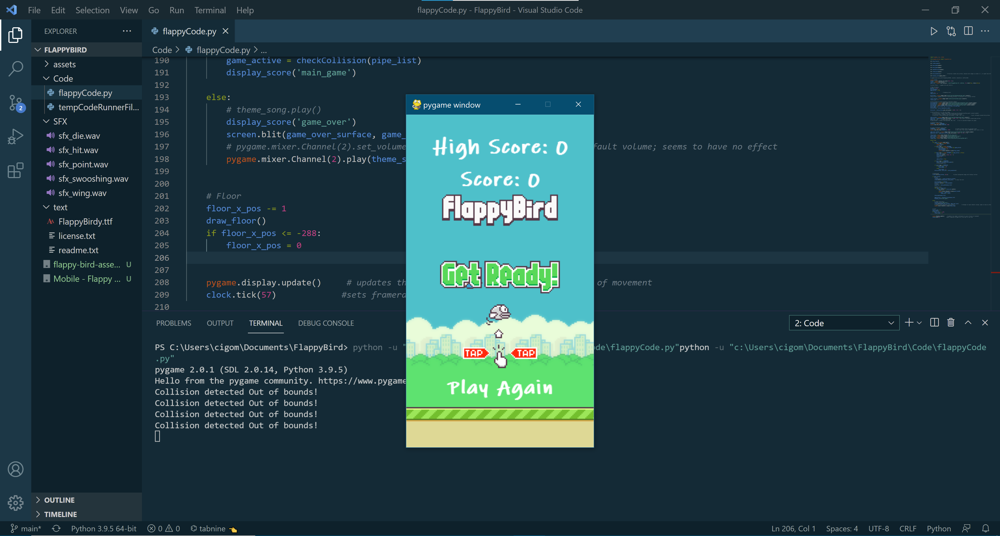
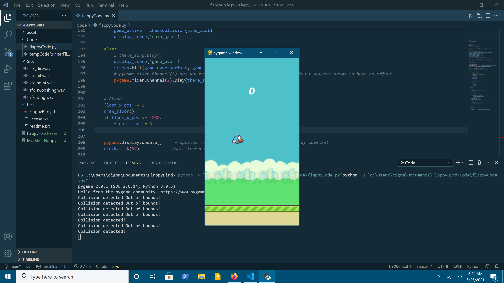

# flappyBirdy
FlappyBird game made with Pygame Engine and Python. Super easy and simple to learn and play. Shoutout to ClearCode on Youtube for this tutorial

# Requirements
You must have python installed on your system to play this game

# How To Play
1. Clone the repository to your local directory
2. Open your favorite command line
3. Run the game using "python -u ["filepath"]

# GamePlay:
Main Screen:

Game Screen:

